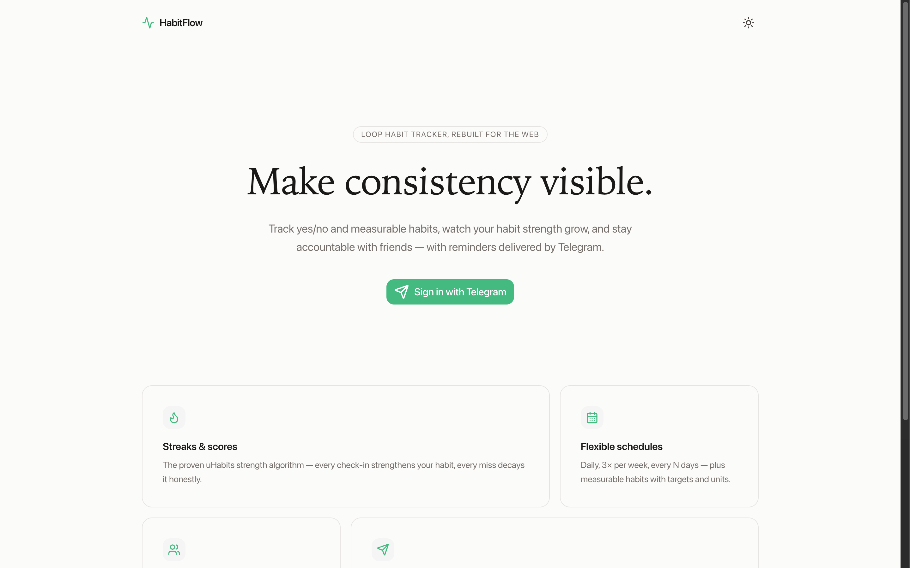
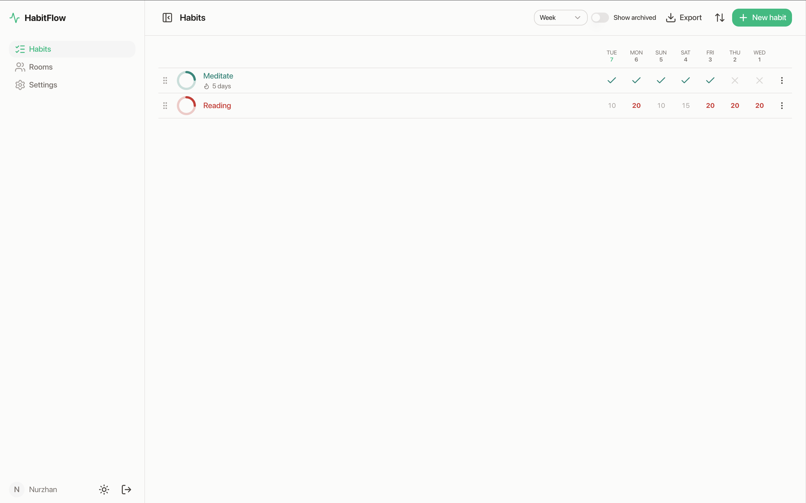
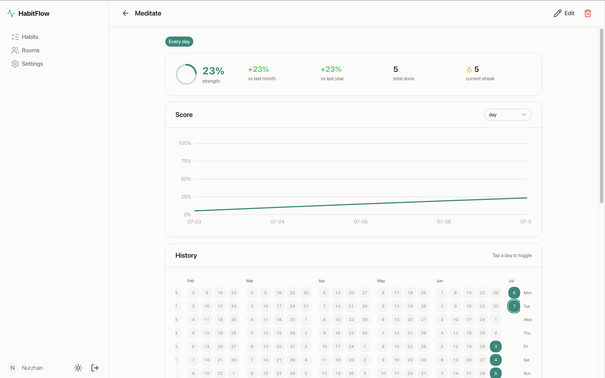
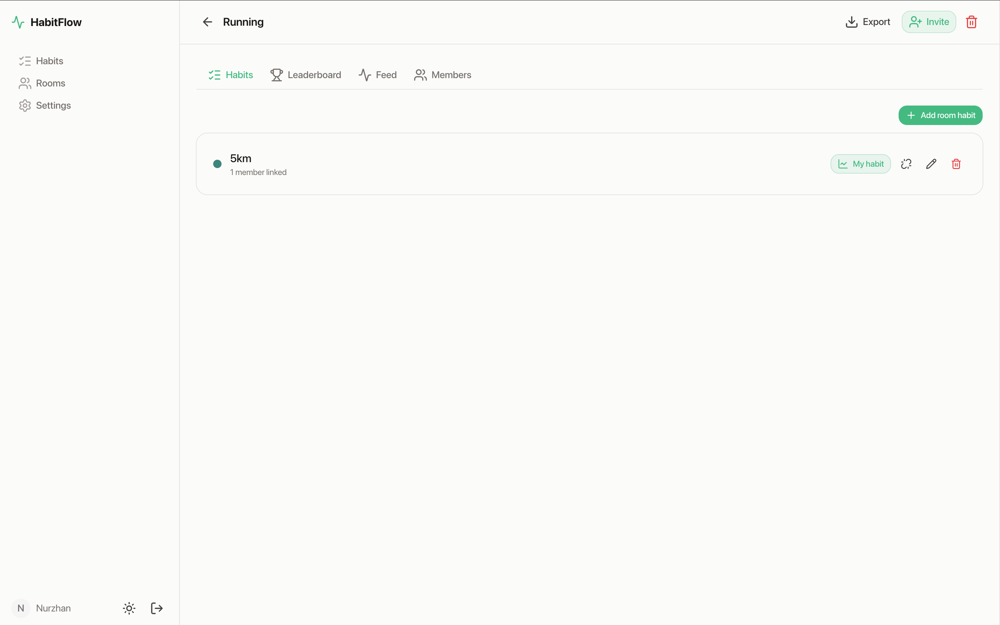
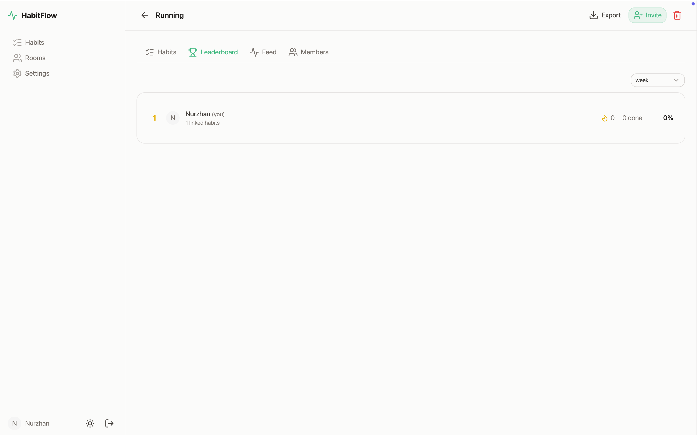
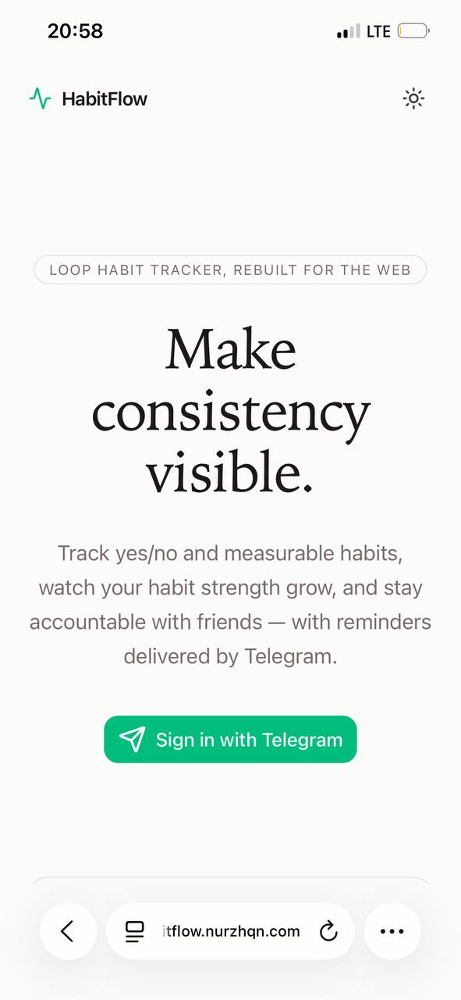
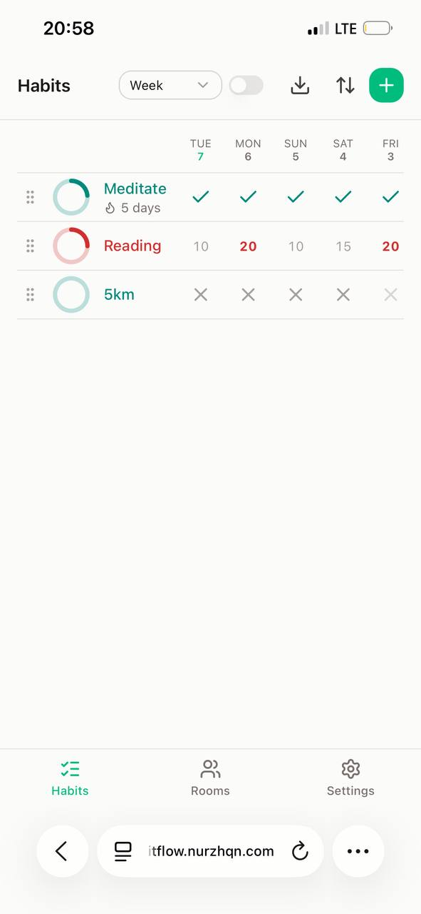
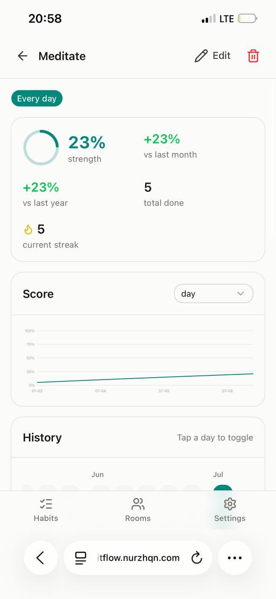
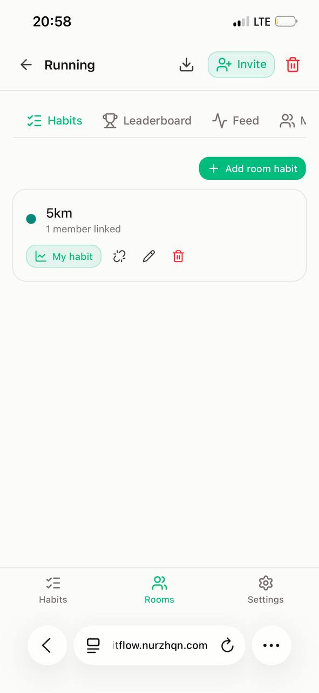
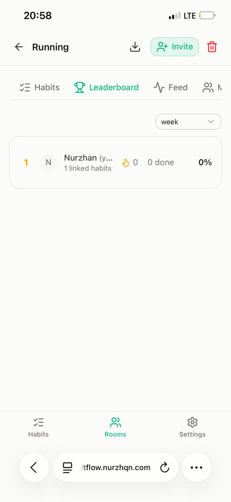

<h1 align="center">HabitFlow</h1>

<p align="center">
  <a href="https://github.com/nurzhqn0/habit-tracker">
    
  </a>
  <a href="https://github.com/iSoron/uhabits">
    
  </a>
</p>

HabitFlow is a Telegram Mini App that helps you create and maintain good habits
— together with your friends. It is a full web rebuild of [Loop Habit Tracker
(uHabits)](https://github.com/iSoron/uhabits), powered by a line-by-line port of
the original habit engine, with shared rooms, leaderboards, and a companion bot
on top. Open it inside Telegram and you are signed in instantly — no passwords,
no registration. Detailed charts and statistics show you how your habits
improved over time.

## Screenshots

<p align="center">
  
  
</p>
<p align="center">
  
  
</p>
<p align="center">
  
</p>

<p align="center">
  
  
  
  
  
</p>

## Features

* **The original Loop engine, on the web.** HabitFlow's scoring is a
  line-by-line Python port of uHabits' habit engine. Every repetition makes
  your habit stronger, and every missed day makes it weaker. A few missed days
  after a long streak, however, will not completely destroy your progress. The
  port is verified against 38 golden tests transcribed from the uHabits test
  suite, with parity at 1e-6 — your scores match the original app exactly.

* **Habit rooms.** Habits are easier to keep when you don't keep them alone.
  Create a room, invite friends by link or Telegram username, attach shared
  habits, and compete on a per-room leaderboard (score, streak, or
  completions). An activity feed shows who checked in, and owner/admin/member
  roles let you manage the room together.

* **Telegram-native.** HabitFlow runs as a Telegram Mini App: open it from the
  bot and it signs you in automatically from Telegram's signed `initData` — no
  passwords and no registration forms. It adopts Telegram's light/dark theme and
  native chrome, with the back button, haptics, and fullscreen on mobile. A
  companion bot sends reminders at each habit's chosen time, in your own
  timezone, on the days you pick — check off or skip your habit directly from the
  chat with inline ✅ Done / ⏭ Skip / 🕐 Later buttons.

* **Flexible habits and schedules.** Yes/no and measurable habits (at-least /
  at-most targets with units), daily or more complex schedules such as 3 times
  per week or every N days, skip days, per-entry notes, archiving, manual
  ordering, and the classic 20-color uHabits palette.

* **Detailed charts and statistics.** Habit strength score, streaks, calendar
  heatmap, score history, weekday breakdown, and target progress — all
  custom-built SVG, dark-theme aware, and always computed on the fly from your
  raw check-ins. Scores and streaks are derived, never persisted.

* **Take control of your data.** Export any habit or room to Excel reports for
  a chosen period, or to Loop-compatible CSV (ZIP) — and import your existing
  history straight from the Android app, so years of progress carry over.

* **No limitations.** Track as many habits as you wish. All features are
  available to all users. There are no advertisements and no in-app purchases.

* **Self-hostable and private.** The entire stack — web app, API, bot, and
  database — ships as a single Docker Compose file. Your data lives in a
  SQLite file on your own server and is never sent to anyone.

## Stack

| Layer | Tech |
|---|---|
| Frontend | Nuxt 4, Vue 3, Nuxt UI v4, Pinia, custom SVG charts |
| Backend | FastAPI, SQLAlchemy 2.0 (async) + SQLite (WAL), Alembic, clean architecture (domain / application / infrastructure / api) |
| Bot | aiogram 3 worker process + APScheduler |
| Auth | Telegram Mini App `initData` (HMAC via bot token); Login Widget + redirect-code fallback for browsers → JWT access + rotating refresh tokens |
| Deploy | Docker Compose: nginx reverse proxy + api + bot + frontend, shared SQLite volume |

## Installing

The easiest way to run HabitFlow is with Docker Compose:

```bash
cp .env.example .env            # set JWT_SECRET (openssl rand -hex 32), BOT_TOKEN, BOT_USERNAME,
                                # FRONTEND_ORIGIN=https://your-domain
make up                         # nginx on :80 (and :443 once TLS is configured)
```

Register the Mini App with [@BotFather](https://t.me/BotFather) → `/newapp` (or
**Bot Settings → Menu Button**) and point its Web App URL at
`https://your-domain/app`. For the in-browser Login Widget fallback, also link
your domain via `/setdomain`.

For a full walkthrough — blank Ubuntu server to live HTTPS deployment, with
certs, bot setup, backups, and updates — see [DEPLOY.md](DEPLOY.md).

## Development

Prereqs: [uv](https://docs.astral.sh/uv/), Node 20+.

```bash
cp .env.example .env            # fill BOT_TOKEN / BOT_USERNAME for Telegram features

cd backend && uv sync && cd ..
cd frontend && npm install && cd ..

make migrate                    # create/upgrade the SQLite schema
make api                        # FastAPI on :8000
make web                        # Nuxt on :3000
make bot                        # Telegram bot worker (optional)
```

No bot configured? Set `TEST_MODE=true` for the backend; under `nuxt dev` the
app signs itself in through the TEST_MODE endpoint, so every feature is usable at
http://localhost:3000 without Telegram.

Seed demo data: `cd backend && uv run python scripts/seed.py`

Run the tests:

```bash
make test                       # backend tests, incl. 38 golden engine tests (parity at 1e-6)
cd frontend && npx playwright test   # e2e smoke: login → habit → toggles → charts → room
```

## Architecture notes

- Scores, streaks, and auto-filled entries are **derived, never persisted** —
  SQLite stores only habits and raw entries, mirroring uHabits' design. The
  engine lives in `backend/app/domain/services/` as pure functions (no IO),
  ported line-by-line from `uhabits-core` (`ScoreList.kt`, `StreakList.kt`,
  `EntryList.kt`).
- The bot runs as a separate process sharing the SQLite file via WAL; the API
  never performs Telegram IO — room notifications are written as activity
  events and tailed by the bot worker.

## Contributing

HabitFlow is a hobby project, and contributions are very welcome. There are
several ways to help, even if you are not a developer:

* **Report bugs, suggest features.** The easiest way to contribute is to simply
  use the app and let me know if you find any problems or have any suggestions
  to improve it — please [open an issue](https://github.com/nurzhqn0/habit-tracker/issues).

* **Write some code.** Pull requests are welcome. Set up a local environment
  with the [Development](#development) instructions above, and make sure
  `make test` and `make lint` pass before submitting. For larger changes,
  please open an issue first to discuss the idea.

* **Spread the word.** If you like the project, star the repository and share
  it with your friends and colleagues.

## Acknowledgments

HabitFlow would not exist without [Loop Habit
Tracker](https://github.com/iSoron/uhabits) by Álinson Santos Xavier and its
contributors. The habit engine, scoring formula, entry semantics, and color
palette are ported from the original project.

## License

Copyright (C) 2026 Nurzhan Izimbetov nurzhqn@gmail.com

HabitFlow is free software: you can redistribute it and/or modify it under the
terms of the GNU General Public License as published by the Free Software
Foundation, either version 3 of the License, or (at your option) any later
version.

HabitFlow is distributed in the hope that it will be useful, but WITHOUT ANY
WARRANTY; without even the implied warranty of MERCHANTABILITY or FITNESS FOR
A PARTICULAR PURPOSE. See the GNU General Public License for more details.

You should have received a copy of the GNU General Public License along with
this program. If not, see <https://www.gnu.org/licenses/>.
